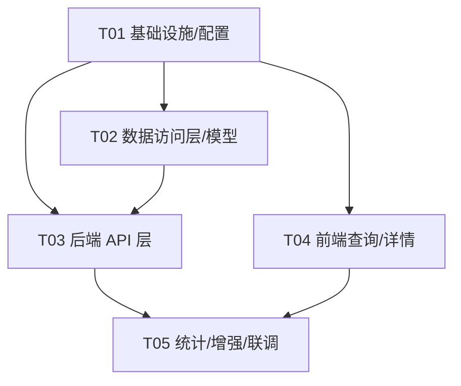
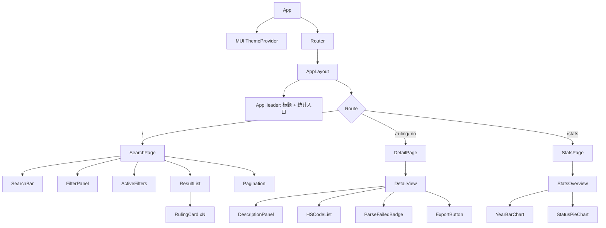

# `cbp_ruling_explorer` 系统架构设计稿

> 文档角色：**架构师（Bob）**产出 · 供工程师施工与 QA 验收
> 配套图件：`docs/class-diagram.mermaid`、`docs/sequence-diagram.mermaid`
> 数据底座：复用既有爬虫项目的 SQLite（`D:\HP\OneDrive\Desktop\学校\项目\生产实习\cbp-crawler\data\db\cbp_rulings.db`，**只读**）

---

## 0. 关键事实（来自对现有库的真实核查）

| 项 | 结论 |
|---|---|
| `rulings` 表 | 字段与 PRD 一致；**当前 0 行**（爬虫尚未落数，需先填充） |
| `html_store` 表 | `id / ruling_no / html_content / plain_text / fetch_status / fetched_at`，按 `ruling_no` 关联 |
| `task_queue` 表 | 爬虫队列，**查询界面不涉及** |
| DB 引擎 | SQLite 3，已开 WAL 模式 |
| Python 环境 | 爬虫侧 Python 3.13+，后端建议同版本 |
| `hs_codes` 存储 | JSON 数组文本，例如 `"[\"1234\",\"123456\"]"` |

> ⚠️ **重要前提**：本界面是只读消费者。开发期工程师需先让爬虫跑出数据，或准备一份种子数据（见 §8 待明确事项）才能联调搜索/统计。

---

## 1. 实现方案 + 框架选型（回答 Q1–Q4、Q6）

### Q1 架构形态 —— 推荐 **(b) 轻量 Python 后端 + React 前端**

**结论：采用 PRD 推荐的 FastAPI 后端 + Vite/React 前端分离架构。**

理由（逐条对比）：

| 方案 | 优点 | 缺点 | 结论 |
|---|---|---|---|
| (a) 纯前端读 SQLite | 无服务端、部署简单 | 浏览器无法直接读本地 .db；需 Electron/Tauri 桌面壳（重、打包复杂）；无中心 API 不便多人/内网共用 | ❌ 否决 |
| **(b) FastAPI 后端 + React 前端** | 后端专注只读查询/导出/统计；自动 OpenAPI 文档；CORS 可控；可本地也可内网；与现有 Python 栈一致 | 多一个进程 | ✅ **采用** |
| (c) 导出静态 JSON 前端加载 | 最简单、零后端 | 数据更新需重新导出；大数据量前端内存压力大；无服务端过滤 | ❌ 不利于"提升检索效率(G2)" |

### Q2 技术栈

- **后端**：`FastAPI` + `uvicorn` + `Pydantic v2` + `SQLite3`（标准库，只读连接）。零 ORM（查询简单，手写参数化 SQL 即可，避免引入 SQLAlchemy 的重量）。
- **前端**：`Vite` + `React 18` + `TypeScript` + `MUI v5` + `Tailwind CSS`。状态管理用 `Zustand`（轻量，适合查询态 + URL 同步）。路由用 `react-router-dom v6`。HTTP 用 `axios`。
- **图表**：统计概览用 `Recharts`（与 MUI 风格契合、体积小）。

### Q3 是否登录鉴权 —— **初期免登录**

- 数据为公开的 CBP 裁定（本就是公开信息），本地/内网只读场景无需账号体系。
- 通过 **CORS 白名单** + **仅绑定本地/内网监听地址** 来控制访问面。
- 预留 `X-API-Key` 中间件钩子（在 `app/main.py` 留 TODO），未来若上公网可一键开启。

### Q4 部署方式 —— **Phase 1 本地桌面优先，Phase 2 内网 Web**

- 提供 `run.py` / `npm run dev` 一键启动脚本，开发者/分析员在本机起后端(`:8000`) + 前端(`:5173`)。
- 内网 Web：用 `uvicorn --host 0.0.0.0` + 前端 `npm run build` 静态托管（或 nginx）。**不建议公网**（见 §8）。

### Q6 大数据量性能：LIKE vs FTS5 —— **P0 用 LIKE，预留 FTS5 扩展点**

- **现状判断**：`rulings` 当前为空，CBP 裁定历史量级预估数千~数万行。在此规模下，`LIKE '%kw%'`（参数化）完全够用，且索引已覆盖 `year / hs_code / parse_failed`，组合过滤走索引。
- **LIKE 取舍**：前导通配 `%kw%` 无法走 B-tree 索引，但数万行全表扫描 < 50ms，用户无感；实现零额外维护。
- **FTS5 取舍**：需建虚拟表 + 同步触发器，复杂度高；仅在数据量 > 5 万 或 搜索相关性/排序成为瓶颈时再上。
- **决策**：`SearchService.build_where()` 抽象出"匹配策略"，P0 走 LIKE，P2 可切换 FTS5 而不动 API 契约。
- **HSCODE 匹配**：用前缀匹配 `hs_code LIKE '1234%'` 或 `substr(hs_code,1,len)=?`；同时若 `hs_codes` JSON 数组中任一元素命中前缀也纳入（用 `LIKE` 或 `json_each` 展开，P0 可简化为仅主 `hs_code` 前缀，P2 再扩展数组匹配）。

---

## 2. 文件列表及相对路径（完整目录结构）

项目根：`D:\HP\OneDrive\Desktop\学校\项目\生产实习\cbp-ruling-explorer\`

```
cbp-ruling-explorer/
├── README.md
├── docs/
│   ├── system_design.md            # 本文档
│   ├── class-diagram.mermaid
│   └── sequence-diagram.mermaid
│
├── backend/                         # FastAPI 只读查询服务
│   ├── requirements.txt             # Python 依赖
│   ├── .env.example                 # CBP_DB_PATH / CORS_ORIGINS / PORT
│   ├── run.py                       # uvicorn 启动入口
│   └── app/
│       ├── __init__.py
│       ├── main.py                  # FastAPI 实例、CORS、路由注册、错误处理
│       ├── config.py                # 配置读取（DB 路径、分页默认、CORS）
│       ├── errors.py                # 统一异常 -> envelope 转换
│       ├── db.py                    # DatabaseManager（只读 SQLite 访问层）
│       ├── schemas.py               # Pydantic：RulingListItem/Detail/Stats/PageResult
│       ├── routers/
│       │   ├── __init__.py
│       │   ├── rulings.py           # GET /api/rulings, /{no}, /export, /{no}/html
│       │   └── stats.py             # GET /api/stats/overview
│       └── services/
│           ├── __init__.py
│           └── search_service.py    # 过滤条件拼装 + 分页 + 导出逻辑
│
└── frontend/                        # React + Vite + MUI + Tailwind
    ├── package.json
    ├── vite.config.ts
    ├── tsconfig.json
    ├── tsconfig.node.json
    ├── tailwind.config.js
    ├── postcss.config.js
    ├── index.html
    └── src/
        ├── main.tsx                 # 入口
        ├── App.tsx                  # 根组件 + ThemeProvider + Router
        ├── router.tsx               # 路由表
        ├── theme/theme.ts           # MUI 主题（配色）
        ├── api/
        │   ├── client.ts            # axios 实例 + envelope 拦截
        │   └── rulings.ts           # 各 API 封装
        ├── types/ruling.ts          # TS 接口（camelCase）
        ├── store/
        │   ├── queryStore.ts        # Zustand：查询态 + URL 同步
        │   └── favorites.ts         # localStorage 收藏（P2）
        ├── hooks/
        │   ├── useRulings.ts        # 列表查询 hook
        │   └── useStats.ts          # 统计查询 hook
        ├── utils/
        │   ├── format.ts            # 日期/状态格式化
        │   └── export.ts            # 前端辅助导出（兜底）
        ├── components/
        │   ├── layout/
        │   │   ├── AppHeader.tsx    # 标题栏 + 统计入口
        │   │   └── AppLayout.tsx    # 整体布局/容器
        │   ├── search/
        │   │   ├── SearchBar.tsx    # 关键词 + 裁定编号
        │   │   ├── FilterPanel.tsx  # 年份/状态/HSCODE/清除（移动端抽屉）
        │   │   └── ActiveFilters.tsx# 已选条件 chips
        │   ├── results/
        │   │   ├── ResultList.tsx   # 卡片列表容器
        │   │   ├── RulingCard.tsx   # 单卡：no|subject|year|hs|status
        │   │   └── Pagination.tsx   # 分页（页大小 25）
        │   ├── detail/
        │   │   ├── DetailView.tsx   # 详情主体
        │   │   ├── DescriptionPanel.tsx # 全文可滚动
        │   │   ├── HSCodeList.tsx   # 主 HS + 全部 HS
        │   │   └── ParseFailedBadge.tsx # 解析失败提示
        │   ├── stats/
        │   │   ├── StatsOverview.tsx# 概览页
        │   │   ├── YearBarChart.tsx # 按年
        │   │   └── StatusPieChart.tsx # 按状态
        │   └── common/
        │       ├── StatusBadge.tsx  # 状态色标
        │       ├── ExportButton.tsx # 导出 CSV/JSON
        │       ├── Loading.tsx
        │       └── ErrorBoundary.tsx
        └── pages/
            ├── SearchPage.tsx       # 查询页（搜索+筛选+列表）
            ├── DetailPage.tsx       # 详情页
            └── StatsPage.tsx        # 统计概览页
```

---

## 3. 数据结构与接口（类图 / REST 契约）

### 3.1 后端数据访问层 + 模型（Mermaid classDiagram）

见 `docs/class-diagram.mermaid`（已生成）。要点：

- `DatabaseManager`：只读连接，方法 `fetch_rulings / fetch_ruling_by_no / fetch_stats / fetch_html`。
- `SearchService`：把 `SearchParams` 翻译成参数化 `WHERE` 子句并分页。
- Pydantic 响应模型分层：`RulingListItem`（列表用，字段精简）→ `RulingDetail`（详情用，继承并扩展 `description / hs_codes / detail_url / parse_error_msg`）。
- `StatsOverview` 聚合 `YearCount` 与 `StatusCount`。
- 前端 TS 类型（`RulingItemFE` / `QueryState`）与后端 snake_case 字段通过 `api/client.ts` 做映射。

### 3.2 前后端 REST API 契约

**基础约定**
- Base URL（开发）：`http://localhost:8000`
- 所有响应统一 `envelope`：`{ "code": 0, "message": "ok", "data": <T> }`（`code=0` 成功，非 0 见 §7）。
- 分页参数：`page`（从 1 起）、`page_size`（默认 25，上限 100）。
- 日期均返回 ISO 8601 字符串。

#### 端点总表

| # | 方法 | 路径 | 说明 | 优先级 |
|---|---|---|---|---|
| 1 | GET | `/api/rulings` | 复合搜索/筛选（关键词、编号、年份、状态、HSCODE）+ 分页 | P0 |
| 2 | GET | `/api/rulings/{ruling_no}` | 单条详情（全文+官方链接+解析失败信息） | P0 |
| 3 | GET | `/api/stats/overview` | 统计概览（总量/按年/按状态/解析失败数） | P1 |
| 4 | GET | `/api/rulings/export` | 按当前筛选条件导出 CSV/JSON | P1 |
| 5 | GET | `/api/rulings/{ruling_no}/html` | 原文 HTML（P2，原始 HTML 查看） | P2 |

#### 端点 1：`GET /api/rulings`

**Query 参数**

| 参数 | 类型 | 必填 | 说明 |
|---|---|---|---|
| `keyword` | string | 否 | 模糊匹配 `subject` + `description`（LIKE %kw%） |
| `ruling_no` | string | 否 | 精确或前缀匹配裁定编号 |
| `year` | int | 否 | 年份精确过滤 |
| `status` | string | 否 | 状态精确过滤（active/revoked/…） |
| `hs_code` | string | 否 | 4/6/10 位前缀匹配主 `hs_code` |
| `page` | int | 否 | 页码，默认 1 |
| `page_size` | int | 否 | 每页条数，默认 25，上限 100 |
| `sort` | string | 否 | `year_desc`(默认) / `year_asc` / `ruling_no` |

**响应 `data`（PageResult\<RulingListItem\>）**

```json
{
  "code": 0,
  "message": "ok",
  "data": {
    "items": [
      { "ruling_no": "N12345", "subject": "Toy classification", "year": 2023,
        "hs_code": "9503", "status": "active", "parse_failed": false }
    ],
    "total": 1, "page": 1, "page_size": 25, "total_pages": 1
  }
}
```

#### 端点 2：`GET /api/rulings/{ruling_no}`

**响应 `data`（RulingDetail）**

```json
{
  "code": 0, "message": "ok",
  "data": {
    "ruling_no": "N12345", "subject": "Toy classification",
    "description": "全文内容……", "hs_code": "9503",
    "hs_codes": ["9503", "950300"], "year": 2023,
    "ruling_date": "2023-05-12", "status": "active",
    "detail_url": "https://rulings.cbp.gov/ruling/N12345",
    "parse_failed": false, "parse_error_msg": ""
  }
}
```

> 若 `parse_failed=true`，前端展示红色提示条并显示 `parse_error_msg`。

#### 端点 3：`GET /api/stats/overview`

**响应 `data`（StatsOverview）**

```json
{
  "code": 0, "message": "ok",
  "data": {
    "total": 1280, "parse_failed": 37,
    "by_year": [ {"year": 2023, "count": 410}, {"year": 2022, "count": 380} ],
    "by_status": [ {"status": "active", "count": 900}, {"status": "revoked", "count": 343} ]
  }
}
```

#### 端点 4：`GET /api/rulings/export`

| 参数 | 说明 |
|---|---|
| 复用端点 1 的全部过滤参数 | 导出**当前筛选结果**（非仅当前页） |
| `format` | `csv`（默认）或 `json` |
| `fields` | 可选，指定导出字段 |

**响应**：`Content-Disposition: attachment` 直接返回文件流（CSV/JSON），HTTP 200。错误仍走 envelope（如筛选无效返回 400）。

#### 端点 5（P2）：`GET /api/rulings/{ruling_no}/html`

**响应 `data`**：`{ "html_content": "...", "plain_text": "...", "fetch_status": 200 }`。前端用 `<iframe sandbox>` 或新标签展示。

---

## 4. 程序调用流程（时序图）

见 `docs/sequence-diagram.mermaid`（已生成）。覆盖三条链路：

1. **关键词搜索 → 列表**：用户输词 → `queryStore` 同步 URL → `GET /api/rulings` → `SearchService` 拼 WHERE → `DatabaseManager` 查 SQLite → 返回 `PageResult` → 渲染卡片 + 分页。
2. **点击详情**：点卡片 → 路由跳 `/ruling/:no` → `GET /api/rulings/:no` → 返回 `RulingDetail` → 渲染全文 + 官方链接 + 解析失败提示。
3. **统计概览**：入口 → `GET /api/stats/overview` → `fetch_stats` 聚合 → 渲染图表。

---

## 5. 任务列表（施工清单 · 有序 · 含依赖）

> 派发给工程师。按依赖顺序实现，T01 为基础设施，全部 ≤ 5 个任务、每任务 ≥ 3 文件、按模块分组。

| 任务 | 名称 | 源文件（节选） | 依赖 | 优先级 |
|---|---|---|---|---|
| **T01** | 项目基础设施与配置 | `backend/requirements.txt`、`backend/run.py`、`backend/app/main.py`、`backend/app/config.py`、`frontend/package.json`、`frontend/vite.config.ts`、`frontend/tailwind.config.js`、`frontend/tsconfig.json`、`frontend/index.html`、`frontend/src/main.tsx`、`frontend/src/App.tsx` | — | P0 |
| **T02** | 后端数据访问层与模型 | `backend/app/db.py`、`backend/app/schemas.py`、`backend/app/config.py`、`backend/app/errors.py` | T01 | P0 |
| **T03** | 后端 API 层（搜索/详情/统计/导出） | `backend/app/services/search_service.py`、`backend/app/routers/rulings.py`、`backend/app/routers/stats.py`、`backend/app/main.py`（注册） | T01, T02 | P0 |
| **T04** | 前端查询与详情核心 | `frontend/src/api/client.ts`、`frontend/src/api/rulings.ts`、`frontend/src/types/ruling.ts`、`frontend/src/store/queryStore.ts`、`frontend/src/components/search/*`、`frontend/src/components/results/*`、`frontend/src/components/detail/*`、`frontend/src/pages/SearchPage.tsx`、`frontend/src/pages/DetailPage.tsx` | T01 | P0 |
| **T05** | 前端统计与增强 + 路由集成联调 | `frontend/src/components/stats/*`、`frontend/src/components/common/ExportButton.tsx`、`frontend/src/store/favorites.ts`、`frontend/src/router.tsx`、`frontend/src/pages/StatsPage.tsx`、`frontend/src/theme/theme.ts`、（P2）`backend/app/routers/rulings.py` 的 html 端点 + 前端 HTML 查看 | T03, T04 | P1/P2 |

**依赖关系图**（Mermaid graph）：



---

## 6. 依赖包列表

### 后端（Python）— `backend/requirements.txt`

```
fastapi>=0.110.0        # Web 框架
uvicorn[standard]>=0.29.0  # ASGI 服务器
pydantic>=2.6.0         # 数据校验/响应模型
python-multipart>=0.0.9 # 表单(如需)
# SQLite3 为标准库，无需安装
```

### 前端（JS）— `frontend/package.json`

```
react@^18.2.0
react-dom@^18.2.0
react-router-dom@^6.22.0
@mui/material@^5.15.0
@mui/icons-material@^5.15.0
@emotion/react@^11.11.0
@emotion/styled@^11.11.0
zustand@^4.5.0
axios@^1.6.0
recharts@^2.12.0
# 开发依赖
vite@^5.1.0
@vitejs/plugin-react@^4.2.0
typescript@^5.3.0
tailwindcss@^3.4.0
postcss@^8.4.0
autoprefixer@^10.4.0
@types/react @types/react-dom
```

---

## 7. 共享知识（跨文件约定）

| 约定项 | 规则 |
|---|---|
| **字段命名** | 后端/DB 用 `snake_case`；前端 TS 用 `camelCase`。映射集中在 `frontend/src/api/client.ts`（响应拦截器自动转换）。 |
| **响应 envelope** | 所有成功/失败响应均为 `{ code:int, message:string, data:T|null }`。`code=0` 成功；`code≠0` 业务错误。 |
| **HTTP 状态码** | 2xx 成功；4xx 客户端错误（参数非法 400 / 未找到 404）；5xx 服务异常。业务错误优先用 envelope.code 表达。 |
| **分页参数** | 请求：`page`(≥1)、`page_size`(默认 25，上限 100)。响应：`items / total / page / page_size / total_pages`。 |
| **HSCODE 匹配** | 前缀匹配主 `hs_code`（4/6/10 位）；P2 扩展 `hs_codes` JSON 数组元素前缀匹配。入参只允许数字，防注入。 |
| **关键词匹配** | `LIKE` 参数化（值两侧加 `%`），禁止字符串拼接 SQL。 |
| **日期格式** | ISO 8601 字符串（`YYYY-MM-DD` / `YYYY-MM-DDTHH:MM:SS`）。 |
| **CORS** | 后端仅放行 `frontend/.env` 或 `config.CORS_ORIGINS` 中声明的源（开发期 `http://localhost:5173`）。 |
| **DB 连接** | 只读：用 `sqlite3.connect("file:<path>?mode=ro", uri=True)`；WAL 下读不阻塞爬虫写。绝不执行 INSERT/UPDATE/DELETE。 |
| **解析失败数据** | 默认**可见并标注**（列表卡 `parse_failed` 角标 + 详情红色提示），不隐藏。 |
| **收藏（P2）** | 仅存前端 `localStorage`（key：`cbp_favorites`），不写后端。 |
| **配置来源** | 后端路径/端口经 `.env`（`CBP_DB_PATH` 默认指向爬虫 DB）；前端 API base 经 `VITE_API_BASE`。 |

---

## 8. 待明确事项（开放点 + 我的推荐结论）

| 编号 | 问题 | 我的推荐结论 |
|---|---|---|
| Q1 | 架构形态 | ✅ (b) FastAPI + React（见 §1） |
| Q2 | 技术栈 | ✅ Vite+React+TS+MUI+Tailwind；后端 FastAPI（见 §1） |
| Q3 | 登录鉴权 | ✅ 初期免登录；CORS 白名单 + 内网监听；预留 API-Key 钩子 |
| Q4 | 部署方式 | ✅ Phase1 本地桌面一键启；Phase2 内网 Web；**不建议公网**（含官方外链，且为内部分析工具） |
| Q5 | 查询范围 | ✅ P0 仅 `rulings`；`html_store` 留 P2 |
| Q6 | 大数据量性能 | ✅ P0 用 LIKE（数万行无压力）；预留 FTS5 扩展点；>5万再切 |
| Q7 | 解析失败数据 | ✅ 默认标注不隐藏 |
| **A1** | **DB 当前为空（0 行）** | 开发期需：① 先跑爬虫落数；或 ② 提供种子 SQL（`docs/seed_sample.sql`，10~20 条样例）供联调。**需用户确认用哪种**。 |
| **A2** | `status` 枚举取值 | PRD 写"active/revoked等"。建议后端从数据 `DISTINCT(status)` 动态取下拉项，避免硬编码。需确认是否还有 third_party/modified 等取值。 |
| **A3** | `ruling_no` 格式 | 需确认编号规则（如 `N` 前缀 + 数字），影响前缀搜索与校验正则。 |
| **A4** | 导出范围语义 | 端点 4 导出"当前筛选全部结果"还是"当前页"？**推荐导出筛选全集**（更符合 G3 数据再利用）。需确认。 |
| **A5** | 是否要"复制编号/官方链接直达"按钮 | PRD 详情页提到"复制编号"，P2 有"链接直达 CBP"。**推荐 P0 即带"打开官方链接"按钮**（成本低、价值高），复制编号放 P0。 |
| **A6** | FTS5 时机 | 约定阈值：当 `total > 50000` 或搜索 P95 延迟 > 300ms 时启用（埋点后续观测）。 |

---

## 9. UI 设计稿增强（在 PRD 线框图基础上）

### 9.1 组件树（Mermaid flowchart）



### 9.2 状态管理方案

- **`queryStore`（Zustand）**：保存 `{ keyword, rulingNo, year, status, hsCode, page }`。任何筛选变化 → 更新 store → 同步到 URL query（便于分享/刷新保留）→ 触发 `useRulings` 重新拉取。
- **`favorites`（Zustand + persist 中间件）**：P2 收藏，持久化到 `localStorage`。
- **请求态**：`useRulings` / `useStats` 返回 `{ data, loading, error }`，组件按态渲染 `Loading` / `ErrorBoundary` / 列表。

### 9.3 布局与配色建议

- **布局**：顶部固定 `AppHeader`（高度 56px，含项目名 `CBP Ruling Explorer` + 「统计概览」按钮 + 「导出」）；下方主体为查询区（搜索条 + 筛选面板在左/上，结果列表在右/下）。桌面双栏（筛选左 280px 固定 + 列表自适应），移动端筛选收进 `Drawer`。
- **配色（MUI 主题）**：
  - Primary：`#1A3E72`（海关深蓝，呼应官方气质）
  - Secondary：`#2E6FB0`
  - Background：`#F5F7FA`（浅灰底，卡片白底 `#FFFFFF` + 轻阴影 `elevation:1`）
  - 状态色标：`active`→绿 `#2E7D32`、`revoked`→红 `#C62828`、`modified`→橙、`third_party`→灰；`parse_failed`→红角标。
- **卡片**：每张 `RulingCard` 显示 `ruling_no`（等宽字体）+ `subject`（主标题，最多 2 行截断）+ 右侧 meta 行（`year · hs_code · StatusBadge`）+ 底部"解析失败"小红点（若 true）。
- **排版**：正文 `Roboto`（MUI 默认），编号用 `monospace` 突出可复制性。

### 9.4 响应式考虑

| 断点 | 行为 |
|---|---|
| `xs`(<600) | 单列；筛选面板收为顶部「筛选」按钮 → Drawer；卡片全宽；分页紧凑 |
| `sm~md` | 筛选仍抽屉或折叠；列表 1~2 列 |
| `lg~xl` | 左侧固定筛选栏 + 右侧多列卡片网格（2~3 列） |

### 9.5 关键交互细节

- 搜索框**回车**或「搜索」按钮提交；筛选下拉**变更即查**（debounce 300ms）。
- 「清除」一键重置 `queryStore` 并清空 URL。
- 列表卡片 hover 高亮；点击进详情；浏览器返回回到原筛选态（URL 同步保证）。
- 详情页「打开官方链接」→ 新标签开 `detail_url`；「复制编号」→ 写剪贴板 + Snackbar 提示。
- 导出：查询页顶部「导出」按当前筛选调端点 4，下载 CSV/JSON。
- 空结果 / 加载中 / 出错 三态均有明确 UI（空态插画 + 提示、Skeleton 加载、错误重试）。

### 9.6 P2 增强预留

- 原始 HTML 查看：详情页「查看原始 HTML」→ 调端点 5，用 `<iframe sandbox="allow-same-origin">` 渲染或新标签打开。
- FTS5：在 `SearchService` 切换匹配策略，UI 无感。
- 收藏：卡片加星按钮 + 个人收藏夹（可后续加 `/favorites` 页）。

---

## 10. 验收要点（给 QA / 团队 lead 速览）

1. 后端 5 个端点全部按 envelope 返回，分页参数生效。
2. 关键词/编号/年份/状态/HSCODE 单条件与组合（AND）过滤正确。
3. 解析失败数据可见且标注，不丢失。
4. 详情页展示全文 + 官方链接可跳转 + 复制编号可用。
5. 导出 CSV/JSON 字段完整、编码正确（UTF-8 with BOM 防 Excel 乱码）。
6. 统计概览四项（总量/按年/按状态/解析失败数）与 DB 实际一致。
7. 响应式在 375 / 768 / 1440 三档无破版。
8. 后端**只读**——对爬虫 DB 无任何写操作（可用 WAL 校验或文件 mtime 不变验证）。

---
*文档结束 · 架构师 Bob · 配套图：`class-diagram.mermaid`、`sequence-diagram.mermaid`*
